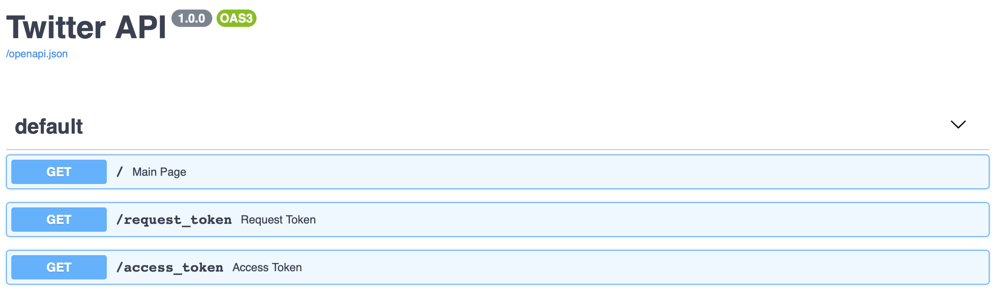
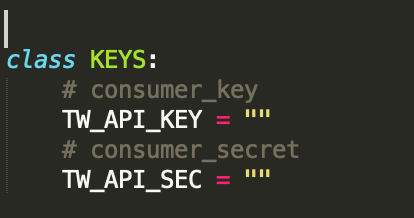

# FastAPI Twitter Auth
 Create twitter authentication API using FastAPI.

## Introduction
Fast API template for social authentication using twitter API. This API can be used as python backend for mobiles and websites login and registration using twitter.




## Requirements
Install the application requirements using following command:
```
pip install -r requirements.txt
```

## Setup Instructions
1. Install the requirements.
2. Create twitter application and fill the configuration keys inside ```Config.py```.



3. Run the API using python.
```
cd social_api
python main.py
```

## How to use
### Twitter Authentication
From your client application:
1. Call **request_token** function with a callback URL to get outh token .
   * Make sure the callback URL defined in the twitter application.
2. Redirect the user to twitter authentication page with outh token parameter.

https://api.twitter.com/oauth/authenticate?oauth_token=<token_code>

3. Twitter will redirect the user to the callback URL with the login verifier.
4. Use the login verifier from twitter to perform the login functionality using **access_token** function.
   * This function will return the user identification details such as user id and screen name.


License
-------
    The MIT License (MIT)

    Copyright (c) 2017 Ahmad Barqawi (github.com/Barqawiz)

    Permission is hereby granted, free of charge, to any person obtaining a copy
    of this software and associated documentation files (the "Software"), to deal
    in the Software without restriction, including without limitation the rights
    to use, copy, modify, merge, publish, distribute, sublicense, and/or sell
    copies of the Software, and to permit persons to whom the Software is
    furnished to do so, subject to the following conditions:

    The above copyright notice and this permission notice shall be included in all
    copies or substantial portions of the Software.
